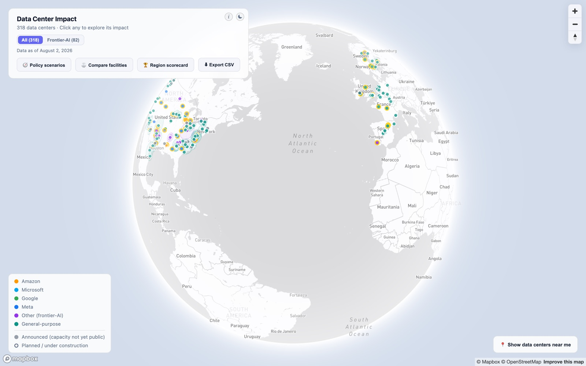
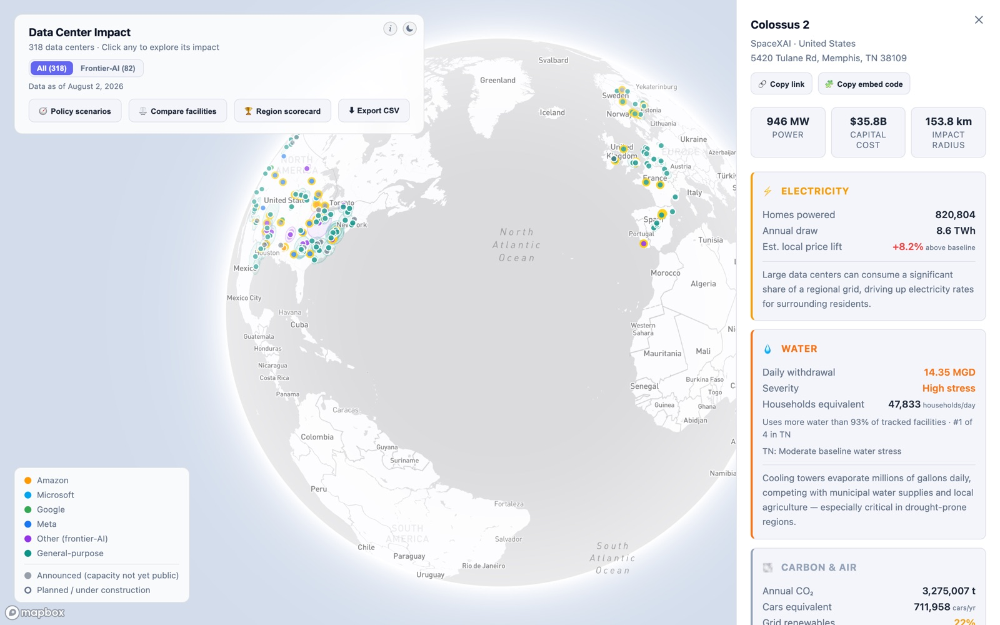
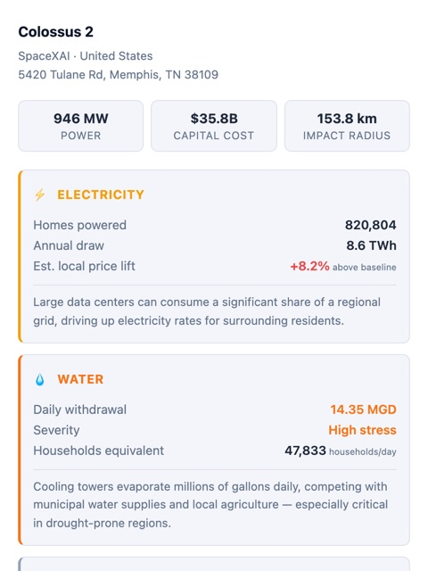
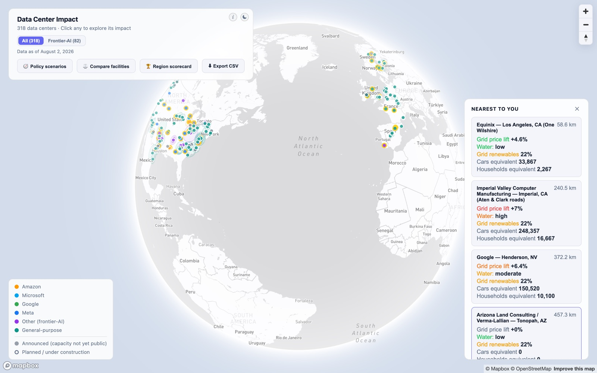
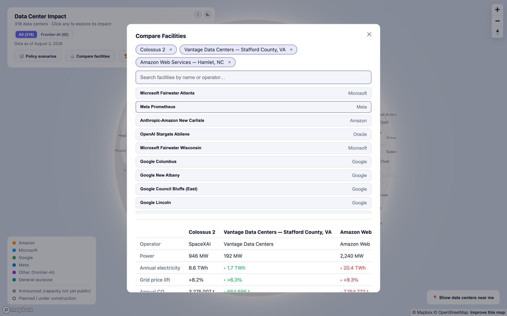
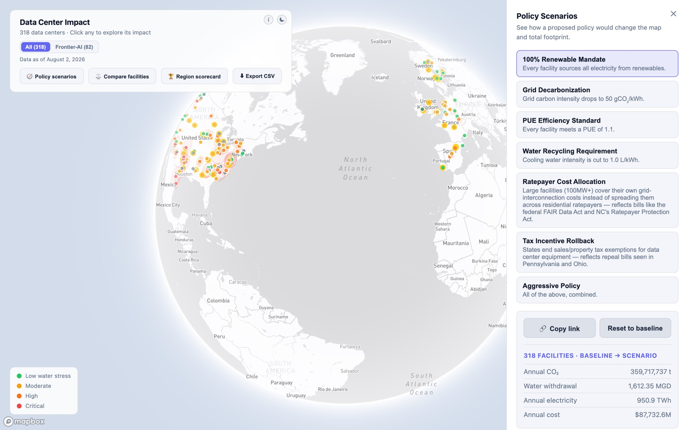
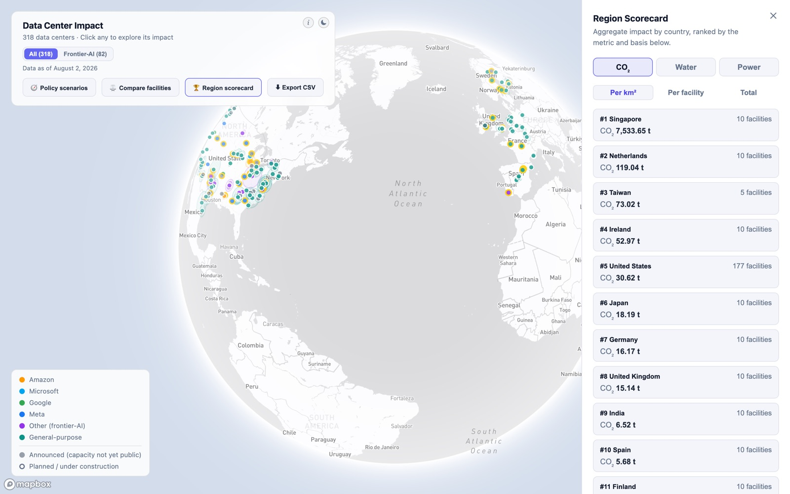
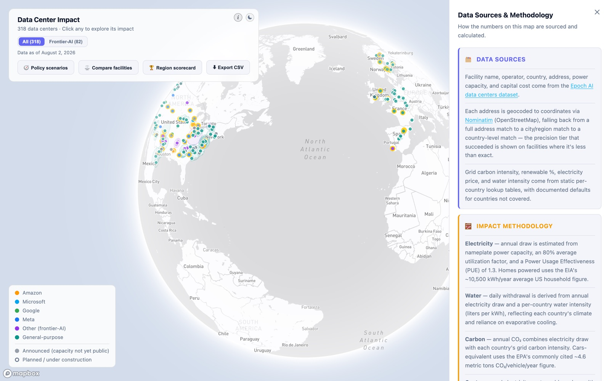
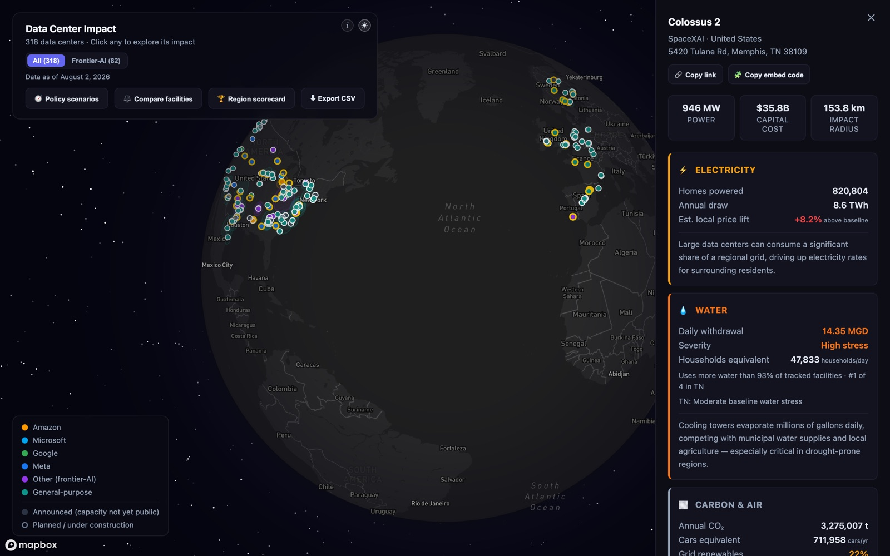

# Data Center Impact

**Try it: [data-centers-delta.vercel.app](https://data-centers-delta.vercel.app)**

An interactive map of 318 large data centers around the world, and what they
cost the communities around them: the electricity they draw, the water they
use, the carbon they emit, and the land and heat they take up.

> This is an early preview (v0). The numbers are **estimates**, built from
> public data about each facility and averages for the country it's in, not
> measurements from the facilities themselves. Treat them as a sense of scale,
> not exact figures.

---

## Getting around the map

- **Drag** to spin the globe, **scroll** or use the **+ / −** buttons to zoom.
- Each dot is a data center. Its **color** shows who runs it (Amazon,
  Microsoft, Google, Meta, other AI labs, or general-purpose operators). The
  key is in the bottom-left corner.
- **Gray dots** are announced projects whose size hasn't been made public yet.
  **Hollow dots** are planned or still under construction.
- Use the **All / Frontier-AI** switch at the top to show every facility, or
  only the 82 campuses built for the major AI labs.
- The **☾** button switches to dark mode.

## Explore a single data center

Click any dot to open its details.

At the top you'll see the facility's size (in megawatts of power), its
estimated construction cost, and its **impact radius**: roughly how far out
its effects on the grid and water supply reach. Below that, four sections
break down its footprint in everyday terms:

| Section | What it tells you |
|---|---|
| ⚡ **Electricity** | How many homes' worth of power it uses, and how much it might push up local electricity prices |
| 💧 **Water** | How much water it withdraws each day, how stressed the local water supply already is, and how it ranks against other facilities |
| 🌫️ **Carbon & air** | Yearly CO₂ emissions, shown as an equivalent number of cars, and how clean the local grid is |
| 🌡️ **Land & heat** | How much ground it covers and how much waste heat it gives off |

Two buttons at the top let you share what you're looking at:

- **Copy link** gives you a web address that opens the map straight to this
  facility.
- **Copy embed code** gives you a snippet you can paste into a blog post or
  website to show a small card for this facility:

  

## What's near me?

Click **📍 Show data centers near me** (bottom-right) to see the closest
facilities to you, with distance and a quick summary of each one's impact.
Your location is estimated roughly from your internet connection. The site
won't ask for your precise location.

## Compare facilities side by side

Click **⚖️ Compare facilities**, then search by name or operator and pick two
or more. A table lines them up on power, electricity, price impact, CO₂,
water and more. Green and red arrows show whether each one is better or worse
than the first facility you picked.

## Try out policy scenarios

Click **🧭 Policy scenarios** to see how the picture would change if a
proposed policy became law. Pick one and the whole map updates. The panel
shows the worldwide totals for CO₂, water, electricity and cost before and
after the change.

Scenarios include:

- **100% Renewable Mandate**: every facility runs on renewable electricity.
- **Grid Decarbonization**: the power grid itself gets much cleaner.
- **PUE Efficiency Standard**: facilities must waste less energy on cooling
  and overhead.
- **Water Recycling Requirement**: facilities must cut the water they use for
  cooling.
- **Ratepayer Cost Allocation**: the biggest facilities pay for their own grid
  hookups instead of passing those costs on to households. This is based on
  real bills such as the federal FAIR Data Act.
- **Tax Incentive Rollback**: states end tax breaks for data center equipment,
  as proposed in Pennsylvania and Ohio.
- **Aggressive Policy**: all of the above, combined.

Use **Copy link** in the panel to share the map with a scenario already
applied, or **Reset to baseline** to go back to today's picture.

## See which countries carry the most

Click **🏆 Region scorecard** for a ranking of countries by their data
centers' total impact. You can rank by **CO₂**, **water** or **power**, and
switch between:

- **Per km²**: how concentrated the impact is for the country's size.
- **Per facility**: the average impact of one data center there.
- **Total**: everything added up.

## Download the data

Click **⬇ Export CSV** to download a spreadsheet of whatever the map is
currently showing: every facility's location, size, cost and impact
estimates. If you've picked a scenario or filtered to Frontier-AI, the
download reflects that.

## Where the numbers come from

Click the **ⓘ** button at the top of the panel to see the data sources and a
plain-language explanation of how each estimate is worked out.

In short, the facility list comes from
[Epoch AI's data center dataset](https://epoch.ai/data/data-centers) and
[trackpolicy.org](https://trackpolicy.org). Grid, water and price figures use
averages for each facility's country. The dataset is refreshed monthly. The
date it was last updated is shown under the facility count.

## Dark mode

---

## Known rough edges

This is a preview, so a few things are still being worked on:

- On phones, some of the on-screen panels overlap. It works best on a laptop
  or desktop for now.
- "Near me" can occasionally fail to find your location. If it does, just try
  again.
- Facilities that are only announced or under construction don't show impact
  estimates yet, because they aren't drawing power.

## For developers

Setup instructions live in [`frontend/README.md`](frontend/README.md) and
[`backend/README.md`](backend/README.md).
